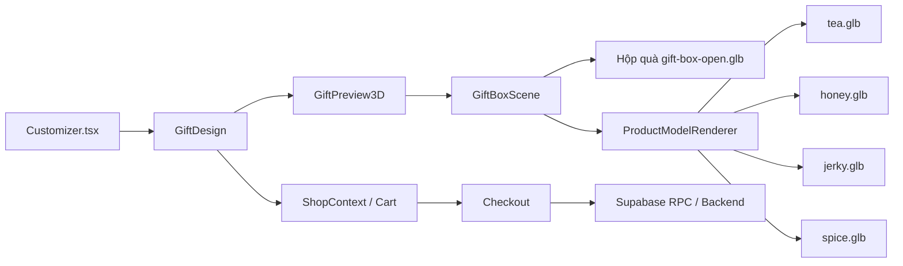
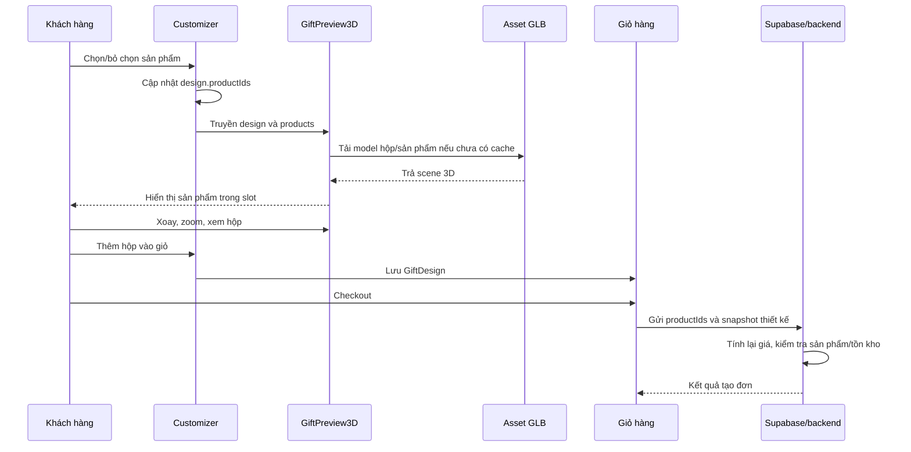

# Đặc tả tích hợp hộp quà 3D — A Sỉn

## 1. Mục lục

- [1. Mục lục](#1-mục-lục)
- [2. Mục tiêu](#2-mục-tiêu)
- [3. Hiện trạng dự án](#3-hiện-trạng-dự-án)
- [4. Kết quả trải nghiệm cần đạt](#4-kết-quả-trải-nghiệm-cần-đạt)
- [5. Kiến trúc giải pháp](#5-kiến-trúc-giải-pháp)
- [6. Định dạng model 3D](#6-định-dạng-model-3d)
- [7. Quy chuẩn bàn giao asset 3D](#7-quy-chuẩn-bàn-giao-asset-3d)
- [8. Cấu trúc thư mục asset](#8-cấu-trúc-thư-mục-asset)
- [9. Cơ chế xoay, zoom và xem hộp](#9-cơ-chế-xoay-zoom-và-xem-hộp)
- [10. Cơ chế chọn sản phẩm và đặt vào hộp](#10-cơ-chế-chọn-sản-phẩm-và-đặt-vào-hộp)
- [11. Mô hình dữ liệu frontend](#11-mô-hình-dữ-liệu-frontend)
- [12. Mô hình dữ liệu Supabase](#12-mô-hình-dữ-liệu-supabase)
- [13. Tích hợp với mã nguồn hiện tại](#13-tích-hợp-với-mã-nguồn-hiện-tại)
- [14. Thiết kế component 3D](#14-thiết-kế-component-3d)
- [15. Luồng hoạt động](#15-luồng-hoạt-động)
- [16. Hiệu năng và khả năng tương thích](#16-hiệu-năng-và-khả-năng-tương-thích)
- [17. Accessibility và fallback](#17-accessibility-và-fallback)
- [18. Bảo mật và tính đúng đắn đơn hàng](#18-bảo-mật-và-tính-đúng-đắn-đơn-hàng)
- [19. Kế hoạch triển khai](#19-kế-hoạch-triển-khai)
- [20. Tiêu chí nghiệm thu](#20-tiêu-chí-nghiệm-thu)
- [21. Thông tin cần chốt trước khi lập trình](#21-thông-tin-cần-chốt-trước-khi-lập-trình)
- [22. Tài liệu tham khảo](#22-tài-liệu-tham-khảo)

## 2. Mục tiêu

Xây dựng trải nghiệm tự thiết kế hộp quà 3D trên trang `/thiet-ke` của A Sỉn.

Khách hàng có thể:

1. Xem một hộp quà 3D lớn đang mở.
2. Kéo chuột hoặc dùng cảm ứng để xoay hộp quanh 360 độ.
3. Xoay góc nhìn lên và xuống để quan sát lòng hộp.
4. Phóng to, thu nhỏ và đặt lại góc nhìn.
5. Chọn các sản vật muốn đặt vào hộp.
6. Thấy ngay từng sản vật xuất hiện hoặc biến mất trong mô hình 3D.
7. Nhìn thấy sản phẩm được đặt đúng vị trí, tỷ lệ và hướng đã định nghĩa.
8. Chọn màu hộp, họa tiết, người nhận và lời nhắn như luồng hiện tại.
9. Thêm bản thiết kế vào giỏ hàng mà không làm thay đổi logic giá và đặt hàng hiện có.

Mục tiêu kỹ thuật là nâng cấp lớp hiển thị từ bản phối 2D sang 3D, không viết lại toàn bộ storefront.

## 3. Hiện trạng dự án

Dự án hiện là React/Vite storefront với các thành phần liên quan:

| Thành phần | Vai trò hiện tại | Định hướng sau khi tích hợp 3D |
|---|---|---|
| `src/Customizer.tsx` | Quản lý các bước thiết kế, sản phẩm được chọn, màu, họa tiết, người nhận và lời nhắn | Giữ nguyên, chỉ truyền dữ liệu vào viewer 3D |
| `src/GiftPreview.tsx` | Bản phối hộp quà 2D bằng HTML/CSS | Giữ làm fallback/thumbnail hoặc thay bằng wrapper 3D |
| `src/catalog.ts` | Định nghĩa `Product`, `GiftDesign`, giá hộp và giá sản phẩm | Bổ sung metadata model 3D khi asset ổn định |
| `src/CatalogContext.tsx` | Cung cấp danh mục sản phẩm | Tiếp tục là nguồn sản phẩm cho viewer |
| `src/ShopContext.tsx` | Quản lý giỏ hàng và thêm hộp quà | Giữ nguyên contract `GiftDesign` |
| `src/services/storeApi.ts` | Tích hợp dữ liệu storefront và checkout | Không để model 3D tự quyết định giá/tồn kho |
| `supabase/migrations/20260921000000_moc_storefront.sql` | Schema vận hành storefront | Chỉ mở rộng sau khi cần quản trị model/slot từ admin |

Hiện tại `GiftPreview.tsx` đã có ghi chú rằng design object là contract chung và có thể thay presentation component bằng vendor 3D viewer. Đây là điểm tích hợp phù hợp.

## 4. Kết quả trải nghiệm cần đạt

### 4.1. Trải nghiệm desktop

- Kéo trái/phải: xoay quanh hộp.
- Kéo lên/xuống: thay đổi góc nhìn cao/thấp.
- Cuộn chuột: zoom.
- Có thể nhấn nút đặt lại góc nhìn.
- Có thể bật/tắt tự xoay nếu cần.

### 4.2. Trải nghiệm mobile

- Một ngón tay: xoay.
- Hai ngón tay: zoom và pan theo khả năng của controls.
- Kích thước viewer phù hợp với màn hình 320px, 390px và 768px.
- Không để canvas 3D làm mất khả năng cuộn trang.
- Các nút chọn sản phẩm vẫn nằm ngoài canvas và dễ bấm.

### 4.3. Trạng thái sản phẩm

- Chưa chọn sản phẩm: hộp vẫn hiển thị bình thường, bên cạnh có hướng dẫn chọn sản vật.
- Đã chọn sản phẩm: model xuất hiện tại slot tương ứng.
- Bỏ chọn sản phẩm: model biến mất khỏi hộp.
- Chọn vượt giới hạn: nút sản phẩm bị disabled hoặc hiển thị lý do.
- Model đang tải: hiển thị loading rõ ràng.
- Model lỗi: hiển thị fallback 2D và thông báo nhẹ, không làm hỏng trang thiết kế.

## 5. Kiến trúc giải pháp

### 5.1. Công nghệ đề xuất

- `three`: engine WebGL.
- `@react-three/fiber`: kết nối Three.js với React.
- `@react-three/drei`: các helper như `useGLTF`, `OrbitControls`, `Environment`, `ContactShadows` và loader.
- Model runtime: `.glb` là lựa chọn mặc định.
- Build tool: giữ nguyên Vite.

### 5.2. Sơ đồ kiến trúc



### 5.3. Nguyên tắc tách trách nhiệm

| Trách nhiệm | Thành phần |
|---|---|
| Chọn/bỏ chọn sản phẩm | `Customizer.tsx` |
| Tính giá hiển thị | `catalog.ts` |
| Render model 3D | `GiftPreview3D.tsx` |
| Đặt model vào đúng chỗ | `giftBoxSlots.ts` hoặc dữ liệu slot |
| Thêm vào giỏ | `ShopContext.tsx` |
| Tính lại giá/tồn kho lúc tạo đơn | Supabase RPC/backend |
| Fallback khi 3D không dùng được | `GiftPreview.tsx` |

## 6. Định dạng model 3D

### 6.1. `.blend` và `.glb` khác nhau thế nào?

`.blend` là file dự án gốc của Blender. Nó phù hợp để người dựng model tiếp tục chỉnh sửa trong Blender nhưng không phải định dạng frontend nên tải trực tiếp trên website.

`.glb` là phiên bản binary của chuẩn glTF, được tối ưu để phân phối model 3D trên web. Một file `.glb` có thể chứa:

- Mesh/geometry.
- Material.
- Texture.
- Camera hoặc light nếu cần.
- Animation nếu model có animation.

Blender có thể mở, chỉnh sửa và xuất model thành `.glb`. Vì vậy:

```text
.blend = file làm việc gốc trong Blender
.glb   = file xuất bản để website sử dụng
```

### 6.2. Xuất `.glb` từ Blender

1. Mở file `.blend` trong Blender.
2. Kiểm tra scale, rotation, origin và texture.
3. Chọn `File > Export > glTF 2.0`.
4. Chọn format `glTF Binary (.glb)`.
5. Bật tùy chọn đóng gói texture nếu cần.
6. Xuất thành file `.glb`.

Không dùng file `.blend` trực tiếp trong website.

### 6.3. `.gltf` và `.glb`

`.gltf` thường gồm file JSON, binary buffer và texture tách rời. `.glb` đóng gói các thành phần đó thành một file. Đối với storefront, `.glb` đơn giản hơn trong việc upload, cache và quản lý đường dẫn.

## 7. Quy chuẩn bàn giao asset 3D

### 7.1. Phương án asset được khuyến nghị

Tách hộp và từng sản phẩm:

```text
gift-box-open.glb
tea.glb
honey.glb
jerky.glb
spice.glb
```

Ưu điểm:

- Sản phẩm có thể tái sử dụng ở nhiều mẫu hộp.
- Có thể thêm sản phẩm mới mà không phải sửa lại toàn bộ hộp.
- Dễ bật/tắt theo `productIds`.
- Dễ thay model sản phẩm mà không thay code viewer.

### 7.2. Phương án một file duy nhất

Có thể bàn giao một file chứa toàn bộ hộp và sản phẩm:

```text
gift-box-all-products.glb
```

Trong scene cần đặt tên node rõ ràng:

```text
gift_box
box_lid
product_tea
product_honey
product_jerky
product_spice
```

Frontend sẽ tìm các node theo tên rồi đổi `visible`. Phương án này phù hợp với một mẫu hộp cố định, nhưng kém linh hoạt hơn khi có nhiều hộp hoặc nhiều biến thể sản phẩm.

### 7.3. Quy chuẩn hình học

Người dựng model cần:

- Apply transforms trước khi xuất.
- Dùng cùng một đơn vị đo cho hộp và sản phẩm.
- Đặt origin hộp ở trung tâm hợp lý.
- Đặt đáy sản phẩm nằm đúng trên mặt đáy hoặc mặt kê trong hộp.
- Không để sản phẩm bị lệch do origin nằm ở vị trí bất thường.
- Kiểm tra hướng trục trước khi xuất.
- Đặt tên object/node không dấu, ổn định và duy nhất.
- Đóng gói texture vào `.glb`.
- Xóa mesh, camera, light và texture không sử dụng.

### 7.4. Hộp đóng/mở

Có hai lựa chọn:

1. Xuất hộp mở sẵn: đơn giản, ổn định và phù hợp MVP.
2. Xuất animation mở nắp: đẹp hơn, nhưng cần kiểm tra animation name, pivot nắp và trạng thái mở mặc định.

Khuyến nghị MVP dùng hộp mở sẵn để khách nhìn thấy sản phẩm ngay. Animation mở nắp có thể làm ở phase sau.

### 7.5. Texture và chất lượng

- Ưu tiên texture đã nén và có kích thước hợp lý.
- Không dùng texture 4K cho chi tiết không nhìn thấy.
- Kiểm tra màu trên màn hình mobile và desktop.
- Nếu model có nhiều texture, cần kiểm tra tổng dung lượng sau khi xuất.
- Không dùng tên file chứa ký tự đặc biệt hoặc dấu tiếng Việt.

## 8. Cấu trúc thư mục asset

### 8.1. Giai đoạn local/static

```text
public/
  models/
    gift-box-open.glb
    products/
      tea.glb
      honey.glb
      jerky.glb
      spice.glb
```

Các file trong `public/` được truy cập bằng URL:

```ts
const boxUrl = "/models/gift-box-open.glb";
const teaUrl = "/models/products/tea.glb";
```

### 8.2. Giai đoạn production/CDN

Khi model lớn hoặc có nhiều phiên bản, có thể chuyển asset sang:

- Supabase Storage public bucket.
- CDN riêng.
- Object storage tương thích S3.

Frontend chỉ nhận public URL model. Không đưa secret key hoặc `SUPABASE_SERVICE_ROLE_KEY` vào Vite/frontend.

## 9. Cơ chế xoay, zoom và xem hộp

### 9.1. Điều khiển đề xuất

Sử dụng `OrbitControls`:

- `enableDamping`: chuyển động mượt.
- `minDistance`, `maxDistance`: giới hạn zoom.
- `minPolarAngle`, `maxPolarAngle`: không cho camera lật xuống dưới sàn hoặc xuyên qua hộp.
- Azimuth không giới hạn để xoay ngang toàn vòng.
- Có thể bật `autoRotate` khi người dùng chưa tương tác.

Ví dụ:

```tsx
<OrbitControls
  enableDamping
  minDistance={2.5}
  maxDistance={7}
  minPolarAngle={0.2}
  maxPolarAngle={Math.PI - 0.2}
/>
```

### 9.2. Nút điều khiển bổ sung

Nên có:

- `Đặt lại góc nhìn`.
- `Xoay tự động` nếu cần.
- `Xem toàn bộ hộp`.
- `Ẩn/hiện hướng dẫn` trên mobile.

Không nên bắt khách hàng phải hiểu thao tác 3D mới chọn được sản phẩm. Danh sách sản phẩm và thông tin giá phải luôn nằm ngoài canvas.

## 10. Cơ chế chọn sản phẩm và đặt vào hộp

### 10.1. Slot cố định theo sản phẩm

Với danh mục hiện tại chỉ có vài sản phẩm, có thể dùng map tĩnh:

```ts
export type GiftSlot = {
  position: [number, number, number];
  rotation: [number, number, number];
  scale: number;
};

export const GIFT_SLOTS: Record<string, GiftSlot> = {
  tea: {
    position: [-0.45, 0.18, 0.1],
    rotation: [0, 0.2, 0],
    scale: 0.8,
  },
  honey: {
    position: [0.35, 0.2, 0.12],
    rotation: [0, -0.3, 0],
    scale: 0.75,
  },
  jerky: {
    position: [0, 0.2, -0.35],
    rotation: [0, 0, 0],
    scale: 0.7,
  },
  spice: {
    position: [0.35, 0.17, -0.32],
    rotation: [0, 0.4, 0],
    scale: 0.65,
  },
};
```

### 10.2. Slot tổng quát

Nếu sau này nhiều sản phẩm có thể nằm ở nhiều vị trí, không nên gắn cứng sản phẩm với một slot. Khi đó dùng:

```ts
type GiftSlot = {
  id: string;
  position: [number, number, number];
  rotation: [number, number, number];
  scale: number;
  allowedCategories?: string[];
};
```

Một hàm layout sẽ phân bổ danh sách sản phẩm đã chọn vào các slot còn trống.

### 10.3. Xử lý sản phẩm không có model 3D

Nếu danh mục có sản phẩm chưa được dựng 3D:

1. Dùng ảnh PNG/WebP trên một mặt phẳng 3D tạm thời.
2. Dùng model placeholder có nhãn sản phẩm.
3. Giữ sản phẩm trong danh sách nhưng hiển thị bản phối 2D.

Không nên để sản phẩm biến mất mà không giải thích cho khách hàng.

## 11. Mô hình dữ liệu frontend

### 11.1. `Product`

Kiểu hiện tại cần mở rộng tùy giai đoạn:

```ts
export type Product = {
  id: string;
  name: string;
  category: string;
  origin: string;
  weight: string;
  price: number;
  image: string;
  tag: string;
  description: string;

  // Metadata 3D, có thể optional trong giai đoạn chuyển tiếp
  modelUrl?: string;
  modelScale?: number;
  giftSlot?: string;
};
```

### 11.2. `GiftDesign`

Giữ contract hiện tại:

```ts
export type GiftDesign = {
  productIds: string[];
  color: string;
  pattern: string;
  message: string;
  recipient: string;
};
```

Không cần lưu tọa độ 3D vào `GiftDesign` nếu tọa độ là thuộc tính của mẫu hộp. Điều này giúp thiết kế nhẹ, ổn định và không cho frontend tự gửi vị trí tùy ý.

### 11.3. Model URL và fallback

```ts
const productModelUrls: Record<string, string> = {
  tea: "/models/products/tea.glb",
  honey: "/models/products/honey.glb",
  jerky: "/models/products/jerky.glb",
  spice: "/models/products/spice.glb",
};
```

Có thể dùng `modelUrl?: string` trong `Product` khi dữ liệu đã đến từ Supabase.

## 12. Mô hình dữ liệu Supabase

### 12.1. Giai đoạn MVP

Chưa cần thay đổi schema ngay. Có thể đặt model URL và slot trong code để xác nhận trải nghiệm trước.

### 12.2. Giai đoạn quản trị đầy đủ

Khi cần nhân viên quản trị model từ admin, đề xuất mở rộng như sau:

```text
products
  id
  name
  price
  image_url
  model_url
  model_scale
  is_active

gift_boxes
  id
  name
  model_url
  version
  is_active

gift_box_slots
  id
  gift_box_id
  slot_key
  position_x
  position_y
  position_z
  rotation_x
  rotation_y
  rotation_z
  scale
  sort_order
  is_active
```

### 12.3. Snapshot trong đơn hàng

Đơn hàng cần lưu snapshot thiết kế tại thời điểm checkout:

```json
{
  "giftBoxVersion": "gift-box-open-v1",
  "productIds": ["tea", "honey"],
  "color": "#315442",
  "pattern": "Thổ cẩm",
  "recipient": "Người thương",
  "message": "Gói chút an lành, gửi người thương."
}
```

Snapshot giúp đơn hàng cũ không bị thay đổi khi model hoặc slot được cập nhật sau này.

## 13. Tích hợp với mã nguồn hiện tại

### 13.1. Thay thế presentation, không thay logic

`Customizer.tsx` đã có:

- `design.productIds`.
- Hàm `toggleProduct`.
- `products` từ `useCatalog()`.
- Giá tính từ `giftPrice`.
- Lưu thiết kế local.
- Thêm hộp quà vào giỏ.

Các phần này giữ nguyên.

Thay đổi chính:

```text
GiftPreview.tsx
        ↓
GiftPreview3D.tsx
        ↓
GiftBoxScene + ProductModelRenderer
```

### 13.2. Giữ `GiftPreview` 2D

`GiftPreview` 2D nên tiếp tục tồn tại để:

- Làm thumbnail trong giỏ hàng.
- Làm fallback khi WebGL không hoạt động.
- Hiển thị nhanh trong các khu vực không cần tương tác 3D.
- Tránh tải lại toàn bộ WebGL trong modal giỏ hàng.

### 13.3. Component đề xuất

```text
src/
  GiftPreview.tsx              # Bản phối 2D hiện tại/fallback
  GiftPreview3D.tsx            # Wrapper Canvas
  components/
    GiftBoxScene.tsx            # Scene, ánh sáng, camera
    ProductModel.tsx            # Tải và clone model sản phẩm
    Gift3DControls.tsx          # OrbitControls và reset view
  data/
    giftBoxSlots.ts             # Vị trí slot giai đoạn MVP
  types/
    gift3d.ts                   # Kiểu model/slot nếu cần tách riêng
```

## 14. Thiết kế component 3D

### 14.1. Viewer cơ bản

```tsx
import { Canvas } from "@react-three/fiber";
import {
  ContactShadows,
  Environment,
  OrbitControls,
  useGLTF,
} from "@react-three/drei";

export default function GiftPreview3D() {
  return (
    <div className="gift-3d-stage">
      <Canvas camera={{ position: [3, 2.4, 4], fov: 42 }}>
        <ambientLight intensity={1.5} />
        <directionalLight position={[4, 6, 4]} intensity={2} />
        <Environment preset="studio" />

        <GiftBox />
        <SelectedProducts />

        <ContactShadows
          position={[0, -0.4, 0]}
          opacity={0.35}
          scale={5}
          blur={2}
        />

        <OrbitControls
          enableDamping
          minDistance={2.5}
          maxDistance={7}
          minPolarAngle={0.2}
          maxPolarAngle={Math.PI - 0.2}
        />
      </Canvas>
    </div>
  );
}

function GiftBox() {
  const { scene } = useGLTF("/models/gift-box-open.glb");
  return <primitive object={scene} />;
}
```

### 14.2. Render một sản phẩm

```tsx
import { useGLTF } from "@react-three/drei";
import { useMemo } from "react";

function GiftItem({
  modelUrl,
  slot,
}: {
  modelUrl: string;
  slot: {
    position: [number, number, number];
    rotation: [number, number, number];
    scale: number;
  };
}) {
  const { scene } = useGLTF(modelUrl);
  const clonedScene = useMemo(() => scene.clone(), [scene]);

  return (
    <primitive
      object={clonedScene}
      position={slot.position}
      rotation={slot.rotation}
      scale={slot.scale}
    />
  );
}
```

`useGLTF` cần được gọi trong component con, không gọi trong vòng lặp trực tiếp của component cha nếu việc render model là động.

### 14.3. Loading và lỗi

Viewer cần có:

- `Suspense` cho trạng thái đang tải.
- Loader hiển thị tiến trình hoặc trạng thái “Đang chuẩn bị hộp quà…”.
- Error boundary cho lỗi tải model.
- Fallback về `GiftPreview` 2D nếu lỗi.

## 15. Luồng hoạt động



## 16. Hiệu năng và khả năng tương thích

### 16.1. Tải lazy

Không nên tải Three.js và toàn bộ model ngay ở trang chủ. Chỉ tải viewer khi vào `/thiet-ke` hoặc khi khu vực 3D xuất hiện.

### 16.2. Giảm dung lượng

- Dùng `.glb`.
- Xóa mesh không dùng.
- Giảm polygon ở những mặt không nhìn thấy.
- Nén mesh bằng Draco hoặc Meshopt khi pipeline đã ổn định.
- Nén texture phù hợp.
- Cache model qua HTTP cache/CDN.
- Không tải lại model khi chỉ thay đổi màu, họa tiết hoặc lời nhắn.

### 16.3. Giới hạn render

- Không render hàng chục bản sao cùng một model nếu không cần.
- Clone scene đúng cách.
- Dùng ánh sáng đơn giản.
- Tránh post-processing nặng trong MVP.
- Kiểm tra thiết bị mobile cấp thấp.

### 16.4. Trường hợp WebGL không khả dụng

Kiểm tra khả năng render trước khi khởi tạo viewer. Nếu không khả dụng:

```text
3D không khả dụng
        ↓
Hiển thị GiftPreview 2D
        ↓
Khách vẫn chọn sản phẩm và đặt hàng bình thường
```

## 17. Accessibility và fallback

Canvas 3D không được là nơi duy nhất chứa thông tin quan trọng.

Cần giữ bên ngoài canvas:

- Tên sản phẩm.
- Hình ảnh sản phẩm.
- Giá.
- Trạng thái đã chọn/chưa chọn.
- Tổng tiền.
- Hướng dẫn thao tác.

Các yêu cầu accessibility:

- Nút chọn dùng `aria-pressed` như hiện tại.
- Có `aria-label` cho nút reset view và auto-rotate.
- Không dùng màu sắc 3D làm tín hiệu duy nhất.
- Tôn trọng `prefers-reduced-motion`.
- Có fallback 2D.
- Không giấu sản phẩm hoặc giá chỉ trong hover.

## 18. Bảo mật và tính đúng đắn đơn hàng

Model 3D chỉ là lớp hiển thị và không được xem là nguồn dữ liệu thương mại.

Frontend có thể gửi:

```json
{
  "productIds": ["tea", "honey"],
  "giftDesign": {
    "color": "#315442",
    "pattern": "Thổ cẩm",
    "recipient": "Người thương",
    "message": "Gói chút an lành..."
  }
}
```

Backend/Supabase phải:

- Kiểm tra product ID còn hoạt động.
- Tính lại giá sản phẩm.
- Tính lại giá hộp.
- Kiểm tra tồn kho.
- Không tin `price`, `total`, `modelScale` hoặc vị trí do browser gửi lên.
- Lưu snapshot thiết kế nếu đơn hàng được tạo.
- Không đưa service role key vào frontend.

Việc chọn sản phẩm trong viewer chỉ thay đổi giao diện. Nó không tự thay đổi chính sách giá hoặc tồn kho.

## 19. Kế hoạch triển khai

### Phase 0 — Chuẩn bị asset

- Chốt model hộp mở hay có animation.
- Nhận file `.blend` gốc và file `.glb` xuất bản.
- Nhận model riêng của từng sản phẩm hoặc scene chứa các node sản phẩm.
- Kiểm tra scale, origin, texture, tên node và dung lượng.
- Chốt số lượng sản phẩm tối đa trong một hộp.

### Phase 1 — Viewer 3D tối thiểu

- Cài Three.js/R3F/drei.
- Tạo `GiftPreview3D`.
- Tải `gift-box-open.glb`.
- Thêm camera, ánh sáng và `OrbitControls`.
- Thêm loading/error state.
- Kiểm tra xoay, zoom, mobile.

### Phase 2 — Sản phẩm trong hộp

- Thêm model sản phẩm.
- Tạo `GIFT_SLOTS`.
- Map `design.productIds` vào model.
- Hiển thị/ẩn model theo lựa chọn.
- Kiểm tra từng tổ hợp được phép.

### Phase 3 — Tích hợp UI hiện tại

- Thay viewer tại khu vực preview của `Customizer`.
- Giữ `GiftPreview` 2D cho giỏ hàng và fallback.
- Giữ nguyên `GiftDesign`, `giftPrice`, `addGift`.
- Thêm nút reset view và trạng thái loading.

### Phase 4 — Kiểm thử

- Kiểm thử component và logic slot.
- Chạy `npm test`.
- Chạy `npm run build`.
- Kiểm tra desktop và mobile.
- Kiểm tra WebGL fallback.
- Kiểm tra dữ liệu checkout không bị thay đổi.

### Phase 5 — Quản trị asset và Supabase, nếu cần

- Thêm `model_url` vào sản phẩm.
- Thêm bảng mẫu hộp và slot.
- Upload model vào Storage/CDN.
- Thêm quyền staff/admin nếu cho phép thay model từ admin.
- Lưu version model trong snapshot đơn hàng.

## 20. Tiêu chí nghiệm thu

### 20.1. Chức năng 3D

- [ ] Hộp quà `.glb` tải được trong `/thiet-ke`.
- [ ] Người dùng xoay được toàn bộ vòng ngang.
- [ ] Người dùng nhìn được góc cao/thấp của hộp.
- [ ] Zoom không xuyên vào trong hoặc đi quá xa.
- [ ] Có trạng thái loading.
- [ ] Có xử lý lỗi model.
- [ ] Có nút reset góc nhìn.

### 20.2. Chọn sản phẩm

- [ ] Chọn sản phẩm làm model tương ứng xuất hiện.
- [ ] Bỏ chọn làm model biến mất.
- [ ] Sản phẩm nằm đúng slot.
- [ ] Không bị xuyên mesh hoặc chồng sai ở các tổ hợp được phép.
- [ ] Tỷ lệ sản phẩm hợp lý so với hộp.
- [ ] Sản phẩm chưa có model có fallback rõ ràng.

### 20.3. Tương thích storefront

- [ ] `design.productIds` vẫn là nguồn sự thật cho lựa chọn.
- [ ] Giá vẫn lấy từ `giftPrice`/nguồn dữ liệu sản phẩm.
- [ ] Thêm hộp quà vào giỏ vẫn hoạt động.
- [ ] Thumbnail giỏ hàng không cần tải viewer 3D đầy đủ.
- [ ] Checkout vẫn gửi dữ liệu thiết kế đúng.
- [ ] Backend/Supabase vẫn tính lại giá và tồn kho.

### 20.4. Responsive và accessibility

- [ ] Kiểm tra 320px.
- [ ] Kiểm tra 390px.
- [ ] Kiểm tra 768px.
- [ ] Kiểm tra desktop.
- [ ] Điều khiển trên touch hoạt động.
- [ ] Nút chọn sản phẩm vẫn dễ thao tác.
- [ ] Có fallback 2D khi không có WebGL.
- [ ] Không mất thông tin sản phẩm khi tắt animation.

### 20.5. Build và kiểm thử mã nguồn

- [ ] `npm test` thành công.
- [ ] `npm run build` thành công.
- [ ] Không có lỗi TypeScript.
- [ ] Không có đường dẫn asset sai phân biệt hoa thường.
- [ ] Không commit file nguồn `.blend` dung lượng lớn nếu không cần.
- [ ] Model production có license và nguồn gốc rõ ràng.

## 21. Thông tin cần chốt trước khi lập trình

1. Model hộp được bàn giao là `.blend`, `.glb`, hay cả hai?
2. Hộp mở sẵn hay cần animation mở nắp?
3. Có model 3D riêng cho từng sản phẩm hay một model chứa tất cả?
4. Một hộp được chọn tối đa bao nhiêu sản phẩm?
5. Mỗi sản phẩm có vị trí cố định hay hệ thống cần tự sắp xếp?
6. Có cần nhiều kích thước/mẫu hộp không?
7. Có cần khách đổi màu/họa tiết trực tiếp trên vật liệu 3D không?
8. Model sẽ đặt trong `public/` hay upload lên Supabase Storage/CDN?
9. Có cần staff/admin tự thay model và vị trí slot không?
10. Có cần lưu ảnh chụp snapshot của hộp khi checkout không?

### Khuyến nghị mặc định cho MVP

- Hộp mở sẵn.
- Hộp và từng sản phẩm là các file `.glb` riêng.
- Tối đa 4 sản phẩm.
- Slot cố định trong code.
- Asset đặt trong `public/models/`.
- Viewer 3D chỉ dùng ở `/thiet-ke`.
- Giỏ hàng vẫn dùng thumbnail 2D.
- Chưa mở rộng Supabase cho model/slot cho đến khi trải nghiệm và asset được nghiệm thu.

## 22. Tài liệu tham khảo

- [Three.js OrbitControls](https://threejs.org/docs/pages/OrbitControls.html)
- [Three.js GLTFLoader](https://threejs.org/docs/pages/GLTFLoader.html)
- [React Three Fiber — Loading Models](https://r3f.docs.pmnd.rs/tutorials/loading-models)
- [React Three Fiber — Installation](https://r3f.docs.pmnd.rs/getting-started/installation)
