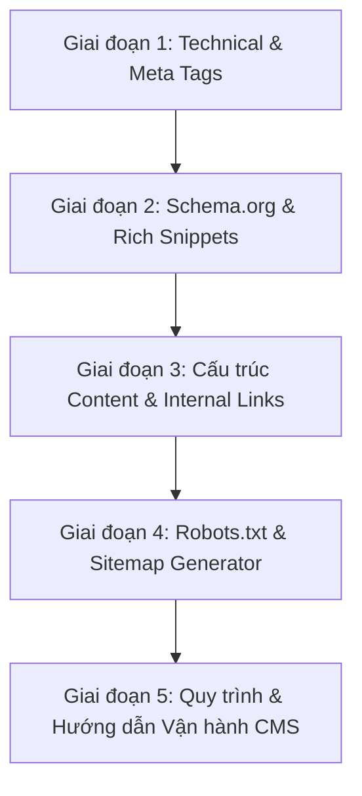

# BẢNG KẾ HOẠCH & CHECKLIST TỐI ƯU HÓA SEO TOÀN DIỆN (A SỈN TÂY BẮC)
> **Dự án**: Website 3D Thương mại & Văn hóa A Sỉn Tây Bắc  
> **Chuyên mục trọng tâm**: Trang Tin tức & Tạp chí (`/tin-tuc`, `/tin-tuc/:slug`)  
> **Phiên bản tài liệu**: 1.0 — Cập nhật ngày 29/09/2026  
> **Mục tiêu**: Đạt điểm tối đa về On-page SEO, Technical SEO, Social Media Preview (Open Graph/Zalo/Facebook), Dữ liệu có cấu trúc Schema.org và chuẩn hóa quy trình xuất bản nội dung cho người biên tập.

---

## 📌 TỔNG QUAN HIỆN TRẠNG & CÁC LỖ HỔNG CẦN XỬ LÝ

| Hạng mục | Trạng thái | Đánh giá kỹ thuật | Mức độ ưu tiên |
| :--- | :---: | :--- | :---: |
| **Thẻ `<title>` & `description`** | Đã có cơ bản | Đổi động qua `document.title` nhưng chưa có fallback chuẩn 404, thiếu độ dài chuẩn. | 🟡 Trung bình |
| **Thẻ Canonical URL** | **Chưa có** | Nguy cơ trùng lặp nội dung khi URL có query parameters hoặc trailing slash. | 🔴 **Khẩn cấp** |
| **Thẻ Open Graph (`og:*`)** | **Chưa có** | Chia sẻ link qua Zalo, Facebook, Messenger không hiện ảnh bìa, tiêu đề hoặc tóm tắt. | 🔴 **Khẩn cấp** |
| **Thẻ Twitter Card (`twitter:*`)** | **Chưa có** | Thiếu preview chuẩn trên X/Twitter. | 🟡 Trung bình |
| **Dữ liệu cấu trúc Schema (JSON-LD)** | **Chưa có** | Google Search không nhận diện được kiểu `BlogPosting` / `Article` và `BreadcrumbList`. | 🔴 **Khẩn cấp** |
| **Thẻ ngữ nghĩa Thời gian (`<time>`)** | Thiếu chuẩn | Bị mất chuỗi ISO 8601 từ Database khi xử lý dữ liệu ở client, hiển thị text thuần. | 🟡 Trung bình |
| **Cấu trúc Headings (H2, H3) trong bài** | **Thiếu** | Thân bài (`body`) chỉ là mảng chuỗi render thẻ `<p>`, không có H2, H3, in đậm, danh sách. | 🔴 **Khẩn cấp** |
| **Internal Linking trong nội dung** | **Thiếu** | Không chèn được link trỏ trực tiếp đến sản phẩm liên quan trong nội dung bài viết. | 🔴 **Khẩn cấp** |
| **Robots.txt & Sitemap.xml** | **Chưa có** | Bot tìm kiếm chưa có bản đồ đường dẫn để lập chỉ mục (index) đầy đủ. | 🔴 **Khẩn cấp** |
| **Xử lý Noindex bài 404 / Ẩn** | **Chưa có** | URL bài viết không tồn tại hiển thị thông báo nhưng bot vẫn có thể index trang rác. | 🟡 Trung bình |

---

## 🚀 ROADMAP THỰC THI (5 GIAI ĐOẠN)



---

## GIAI ĐOẠN 1: TECHNICAL SEO & THẺ META MẠNG XÃ HỘI (OPEN GRAPH)

### 1.1. Thẻ Meta & Open Graph cho Trang Chi tiết Bài viết (`/tin-tuc/:slug`)
- [ ] **Tạo Utility hoặc Hook SEO (`useArticleSeo` hoặc `usePageSeo`)**:
  - Tự động chèn/cập nhật các thẻ `meta` vào `<head>` khi người dùng vào bài viết.
  - Tự động khôi phục thẻ mặc định của website khi chuyển sang trang khác.
- [ ] **Bổ sung đầy đủ thẻ Open Graph (Facebook / Zalo / Telegram)**:
  ```html
  <meta property="og:type" content="article" />
  <meta property="og:title" content="Theo mây lên Suối Giàng, tìm vị trà Shan tuyết — Tạp chí A Sỉn" />
  <meta property="og:description" content="Một buổi sớm se lạnh, búp trà phủ sương và câu chuyện giữ rừng của những người làm trà." />
  <meta property="og:image" content="https://asintaybac.vn/images/tea.webp" />
  <meta property="og:url" content="https://asintaybac.vn/tin-tuc/hanh-trinh-tra" />
  <meta property="og:site_name" content="A Sỉn Tây Bắc" />
  <meta property="og:locale" content="vi_VN" />
  <meta property="article:published_time" content="2026-09-18T00:00:00Z" />
  <meta property="article:section" content="Từ bản làng" />
  <meta property="article:tag" content="Trà Shan Tuyết, Tây Bắc, Đặc sản" />
  ```
- [ ] **Bổ sung thẻ Twitter / X Card**:
  ```html
  <meta name="twitter:card" content="summary_large_image" />
  <meta name="twitter:title" content="Theo mây lên Suối Giàng, tìm vị trà Shan tuyết — Tạp chí A Sỉn" />
  <meta name="twitter:description" content="Một buổi sớm se lạnh, búp trà phủ sương..." />
  <meta name="twitter:image" content="https://asintaybac.vn/images/tea.webp" />
  ```
- [ ] **Thẻ Canonical URL**:
  - Gắn thẻ: `<link rel="canonical" href="https://asintaybac.vn/tin-tuc/hanh-trinh-tra" />`
  - Đảm bảo loại bỏ các query parameters như `?fbclid=...`, `?utm_source=...` khỏi canonical URL.

### 1.2. Xử lý Trạng thái Bài viết Không tồn tại (404 / Bản nháp)
- [ ] Khi `storyId` không tìm thấy trong danh sách bài đã xuất bản:
  - Gắn thẻ: `<meta name="robots" content="noindex, follow" />`
  - Đặt title: `Bài viết không tồn tại — Tạp chí A Sỉn`
  - Hiển thị danh sách 3 bài viết mới nhất gợi ý để giữ chân người đọc (giảm bounce rate).

---

## GIAI ĐOẠN 2: DỮ LIỆU CÓ CẤU TRÚC (SCHEMA.ORG JSON-LD)

### 2.1. Cấu trúc Schema `BlogPosting` cho Bài viết
- [ ] Chèn đoạn script `<script type="application/ld+json">` vào component [Journal.tsx](file:///d:/CloneGithub/Website3DTayBac/src/Journal.tsx) với định dạng chuẩn:
```json
{
  "@context": "https://schema.org",
  "@type": "BlogPosting",
  "mainEntityOfPage": {
    "@type": "WebPage",
    "@id": "https://asintaybac.vn/tin-tuc/hanh-trinh-tra"
  },
  "headline": "Theo mây lên Suối Giàng, tìm vị trà Shan tuyết",
  "description": "Một buổi sớm se lạnh, búp trà phủ sương và câu chuyện giữ rừng của những người làm trà.",
  "image": [
    "https://asintaybac.vn/images/tea.webp"
  ],
  "datePublished": "2026-09-18T00:00:00Z",
  "dateModified": "2026-09-18T00:00:00Z",
  "author": {
    "@type": "Organization",
    "name": "A Sỉn Tây Bắc",
    "url": "https://asintaybac.vn"
  },
  "publisher": {
    "@type": "Organization",
    "name": "A Sỉn Tây Bắc",
    "logo": {
      "@type": "ImageObject",
      "url": "https://asintaybac.vn/favicon.svg"
    }
  },
  "articleSection": "Từ bản làng",
  "inLanguage": "vi-VN"
}
```

### 2.2. Cấu trúc Schema `BreadcrumbList` (Điều hướng phân cấp)
- [ ] Khai báo chuỗi liên kết phân cấp giúp Google hiển thị thanh điều hướng trên kết quả tìm kiếm:
  `Trang chủ > Tin tức & Câu chuyện > Tiêu đề bài viết`
```json
{
  "@context": "https://schema.org",
  "@type": "BreadcrumbList",
  "itemListElement": [
    {
      "@type": "ListItem",
      "position": 1,
      "name": "Trang chủ",
      "item": "https://asintaybac.vn/"
    },
    {
      "@type": "ListItem",
      "position": 2,
      "name": "Tạp chí A Sỉn",
      "item": "https://asintaybac.vn/tin-tuc"
    },
    {
      "@type": "ListItem",
      "position": 3,
      "name": "Theo mây lên Suối Giàng, tìm vị trà Shan tuyết",
      "item": "https://asintaybac.vn/tin-tuc/hanh-trinh-tra"
    }
  ]
}
```

### 2.3. Bổ sung trường Ngày chuẩn ISO 8601
- [ ] Cập nhật [storeApi.ts](file:///d:/CloneGithub/Website3DTayBac/src/services/storeApi.ts):
  - Bổ sung `publishedAtISO: article.published_at` vào interface `PublishedArticle`.
  - Thay thẻ `<span>{story.date}</span>` bằng thẻ ngữ nghĩa chuẩn SEO:
    ```tsx
    <time dateTime={story.publishedAtISO}>{story.date}</time>
    ```

---

## GIAI ĐOẠN 3: NÂNG CẤP CẤU TRÚC NỘI DUNG (ON-PAGE SEO & INTERNAL LINKS)

### 3.1. Hỗ trợ Heading (H2, H3) và Định dạng nhẹ trong Bài viết
Hiện tại mảng `story.body` chỉ render thẻ `<p>`, khiến bài viết thiếu phân cấp tiêu đề.
- [ ] Cập nhật parser nội dung trong [Journal.tsx](file:///d:/CloneGithub/Website3DTayBac/src/Journal.tsx):
  - Dòng bắt đầu bằng `## ` chuyển thành `<h2>`
  - Dòng bắt đầu bằng `### ` chuyển thành `<h3>`
  - Dòng bắt đầu bằng `> ` chuyển thành `<blockquote>` (trích dẫn cảm xúc)
  - Hỗ trợ cú pháp markdown in đậm `**từ khóa**` để làm nổi bật thực thể thực đơn / địa danh Tây Bắc.
  - Hỗ trợ liên kết sản phẩm dạng `[Thịt trâu gác bếp](/san-pham)`.

### 3.2. Chiến lược Liên kết Nội bộ (Internal Linking)
- [ ] **Từ bài viết sang sản phẩm liên quan (Contextual Product Links)**:
  - Khi bài viết nhắc đến *Trà Shan tuyết*, chèn liên kết trực tiếp đến sản phẩm hoặc nút "Xem hộp quà Trà Shan Tuyết".
- [ ] **Widget "Sản vật trong câu chuyện" cuối bài viết**:
  - Thiết kế 1 khối nhỏ ở cuối bài giới thiệu 1–2 sản phẩm liên quan trực tiếp đến nội dung vừa đọc kèm nút "Mua ngay / Cho vào hộp quà".
- [ ] **Điều hướng bài trước / bài sau (Next / Previous Article)**:
  - Giúp bot tìm kiếm thu thập liên tục các bài viết lân cận mà không bị cụt dòng di chuyển (orphan pages).

### 3.3. Tối ưu Thẻ Hình ảnh (Image SEO)
- [ ] Đảm bảo `alt` của ảnh bìa có chứa từ khóa có nghĩa (ví dụ: `"Búp trà Shan tuyết cổ thụ Suối Giàng - A Sỉn"` thay vì chỉ lặp lại nguyên văn tiêu đề bài).
- [ ] Thêm thẻ `<figcaption>` bên dưới ảnh bìa hoặc ảnh trong bài viết để bổ sung ngữ cảnh cho Googlebot.

---

## GIAI ĐOẠN 4: THIẾT LẬP ROBOTS.TXT VÀ SITEMAP.XML

### 4.1. Tạo file `public/robots.txt`
- [ ] Tạo file [public/robots.txt](file:///d:/CloneGithub/Website3DTayBac/public/robots.txt) cho phép bot thu thập toàn bộ trang công khai và chặn các trang nội bộ/admin:
```txt
User-agent: *
Allow: /
Allow: /san-pham
Allow: /thiet-ke
Allow: /gioi-thieu
Allow: /tin-tuc
Allow: /tin-tuc/*
Allow: /lien-he
Disallow: /admin
Disallow: /admin/*
Disallow: /api/

Sitemap: https://asintaybac.vn/sitemap.xml
```

### 4.2. Thiết lập `public/sitemap.xml`
- [ ] Tạo file sitemap gốc chứa danh mục các trang chính và bài viết đã xuất bản:
```xml
<?xml version="1.0" encoding="UTF-8"?>
<urlset xmlns="http://www.sitemaps.org/schemas/sitemap/0.9">
  <!-- Trang chính -->
  <url>
    <loc>https://asintaybac.vn/</loc>
    <changefreq>daily</changefreq>
    <priority>1.0</priority>
  </url>
  <url>
    <loc>https://asintaybac.vn/san-pham</loc>
    <changefreq>weekly</changefreq>
    <priority>0.9</priority>
  </url>
  <url>
    <loc>https://asintaybac.vn/thiet-ke</loc>
    <changefreq>monthly</changefreq>
    <priority>0.8</priority>
  </url>
  <url>
    <loc>https://asintaybac.vn/gioi-thieu</loc>
    <changefreq>monthly</changefreq>
    <priority>0.7</priority>
  </url>
  <url>
    <loc>https://asintaybac.vn/tin-tuc</loc>
    <changefreq>daily</changefreq>
    <priority>0.9</priority>
  </url>
  <url>
    <loc>https://asintaybac.vn/lien-he</loc>
    <changefreq>monthly</changefreq>
    <priority>0.6</priority>
  </url>

  <!-- Các bài viết tạp chí -->
  <url>
    <loc>https://asintaybac.vn/tin-tuc/hanh-trinh-tra</loc>
    <lastmod>2026-09-18</lastmod>
    <changefreq>monthly</changefreq>
    <priority>0.8</priority>
  </url>
  <url>
    <loc>https://asintaybac.vn/tin-tuc/mon-qua-nho</loc>
    <lastmod>2026-09-12</lastmod>
    <changefreq>monthly</changefreq>
    <priority>0.8</priority>
  </url>
  <url>
    <loc>https://asintaybac.vn/tin-tuc/bep-nha</loc>
    <lastmod>2026-09-05</lastmod>
    <changefreq>monthly</changefreq>
    <priority>0.8</priority>
  </url>
  <url>
    <loc>https://asintaybac.vn/tin-tuc/gac-bep-mua-gio</loc>
    <lastmod>2026-08-30</lastmod>
    <changefreq>monthly</changefreq>
    <priority>0.8</priority>
  </url>
</urlset>
```
- [ ] *(Tùy chọn nâng cao)*: Viết 1 script nhỏ trong `scripts/generate_sitemap.ts` để tự động query từ bảng `articles` Supabase khi build production.

---

## GIAI ĐOẠN 5: CHUẨN HÓA TRANG QUẢN TRỊ (ADMIN CMS) & QUY TRÌNH VIẾT BÀI

### 5.1. Nâng cấp Giao diện Soạn thảo [ContentSection.tsx](file:///d:/CloneGithub/Website3DTayBac/src/admin/ContentSection.tsx)
- [ ] **Thêm hộp kiểm tra SEO Realtime (SEO Score Card)**:
  - Đếm độ dài tiêu đề (Khuyến nghị: 45–65 ký tự).
  - Đếm độ dài mô tả ngắn / Excerpt (Khuyến nghị: 130–160 ký tự).
  - Kiểm tra xem tiêu đề đã có trong mô tả ngắn hay chưa.
- [ ] **Thêm khung xem trước hiển thị (SERP & Social Preview)**:
  - Tab 1: **Google Search Preview** (Xem trước hiển thị Tiêu đề xanh, URL và đoạn mô tả trên Google mobile/desktop).
  - Tab 2: **Facebook / Zalo Card Preview** (Xem trước ảnh thumbnail 1200x630, tiêu đề và tên miền).
- [ ] **Hướng dẫn định dạng ngay dưới ô nhập nội dung**:
  - Ghi chú rõ: Nhập `## Tiêu đề mục lớn (H2)`, `### Tiêu đề con (H3)`, `**chữ đậm**` và `[tên link](/san-pham)` để người viết bài dễ thao tác.

### 5.2. Quy trình chuẩn cho Biên tập viên viết bài SEO (SOP Checklist)
Mỗi khi viết một bài mới, người biên tập phải kiểm tra qua các tiêu chí:
1. **Tiêu đề (Title)**: Chứa từ khóa chính ngay nửa đầu tiêu đề (ví dụ: *Trà Shan tuyết*, *Thịt trâu gác bếp*, *Hộp quà Tết Tây Bắc*).
2. **Đường dẫn (Slug)**: Ngắn gọn, không dấu, ngăn cách bằng dấu gạch ngang (ví dụ: `tra-shan-tuyet-suoi-giang`).
3. **Mô tả ngắn (Excerpt)**: Từ 130–160 ký tự, tóm tắt đủ nội dung hấp dẫn, thúc đẩy người dùng click.
4. **Ảnh đại diện (Cover Image)**: Định dạng `.webp`, kích thước tối thiểu `1200x630 px`, dung lượng dưới `200KB` để tối ưu Core Web Vitals (LCP).
5. **Nội dung bài viết**:
   - Ít nhất 2–3 thẻ tiêu đề phụ `## H2` phân tách các luận điểm.
   - Ít nhất 1–2 liên kết nội bộ dẫn tới sản phẩm hoặc bài viết liên quan.
   - Kết bài có lời kêu gọi hành động (Call To Action - CTA) dẫn tới trang xem sản vật hoặc hộp quà.

---

## 🛠️ CHI TIẾT MẪU MÃ NGUỒN CẦN TRIỂN KHAI (CODE TEMPLATES)

### A. Component quản lý thẻ SEO Meta & Schema JSON-LD
Tạo file `src/components/SeoHead.tsx`:
```tsx
import { useEffect } from "react";

export interface SeoProps {
  title: string;
  description: string;
  canonicalPath?: string;
  image?: string;
  type?: "website" | "article";
  publishedTime?: string;
  section?: string;
  noindex?: boolean;
  breadcrumbs?: Array<{ name: string; path: string }>;
}

const DOMAIN = "https://asintaybac.vn";

export function SeoHead({
  title,
  description,
  canonicalPath = "",
  image = "/images/asin/journey-panorama.webp",
  type = "website",
  publishedTime,
  section,
  noindex = false,
  breadcrumbs,
}: SeoProps) {
  useEffect(() => {
    // 1. Title
    document.title = title.includes("A Sỉn") ? title : `${title} — A Sỉn Tây Bắc`;

    // 2. Helper set meta tag
    const setMeta = (nameAttr: string, key: string, content: string) => {
      let el = document.querySelector(`meta[${nameAttr}="${key}"]`);
      if (!el) {
        el = document.createElement("meta");
        el.setAttribute(nameAttr, key);
        document.head.appendChild(el);
      }
      el.setAttribute("content", content);
    };

    // 3. Basic & Robots
    setMeta("name", "description", description);
    setMeta("name", "robots", noindex ? "noindex, follow" : "index, follow, max-image-preview:large");

    // 4. Canonical
    const fullUrl = `${DOMAIN}${canonicalPath}`;
    let linkCanonical = document.querySelector('link[rel="canonical"]');
    if (!linkCanonical) {
      linkCanonical = document.createElement("link");
      linkCanonical.setAttribute("rel", "canonical");
      document.head.appendChild(linkCanonical);
    }
    linkCanonical.setAttribute("href", fullUrl);

    // 5. Open Graph
    const fullImg = image.startsWith("http") ? image : `${DOMAIN}${image}`;
    setMeta("property", "og:type", type);
    setMeta("property", "og:title", title);
    setMeta("property", "og:description", description);
    setMeta("property", "og:url", fullUrl);
    setMeta("property", "og:image", fullImg);
    setMeta("property", "og:site_name", "A Sỉn Tây Bắc");
    setMeta("property", "og:locale", "vi_VN");

    if (type === "article") {
      if (publishedTime) setMeta("property", "article:published_time", publishedTime);
      if (section) setMeta("property", "article:section", section);
    }

    // 6. Twitter Card
    setMeta("name", "twitter:card", "summary_large_image");
    setMeta("name", "twitter:title", title);
    setMeta("name", "twitter:description", description);
    setMeta("name", "twitter:image", fullImg);

    // 7. Schema JSON-LD
    let scriptTag = document.getElementById("jsonld-seo") as HTMLScriptElement | null;
    if (!scriptTag) {
      scriptTag = document.createElement("script");
      scriptTag.id = "jsonld-seo";
      scriptTag.type = "application/ld+json";
      document.head.appendChild(scriptTag);
    }

    const schemas: object[] = [];

    // Article Schema
    if (type === "article") {
      schemas.push({
        "@context": "https://schema.org",
        "@type": "BlogPosting",
        mainEntityOfPage: { "@type": "WebPage", "@id": fullUrl },
        headline: title,
        description,
        image: [fullImg],
        datePublished: publishedTime || new Date().toISOString(),
        dateModified: publishedTime || new Date().toISOString(),
        articleSection: section || "Tin tức",
        inLanguage: "vi-VN",
        author: { "@type": "Organization", name: "A Sỉn Tây Bắc", url: DOMAIN },
        publisher: {
          "@type": "Organization",
          name: "A Sỉn Tây Bắc",
          logo: { "@type": "ImageObject", url: `${DOMAIN}/favicon.svg` }
        }
      });
    }

    // Breadcrumbs Schema
    if (breadcrumbs && breadcrumbs.length > 0) {
      schemas.push({
        "@context": "https://schema.org",
        "@type": "BreadcrumbList",
        itemListElement: breadcrumbs.map((crumb, idx) => ({
          "@type": "ListItem",
          position: idx + 1,
          name: crumb.name,
          item: crumb.path.startsWith("http") ? crumb.path : `${DOMAIN}${crumb.path}`
        }))
      });
    }

    scriptTag.textContent = JSON.stringify(schemas.length === 1 ? schemas[0] : schemas);

    return () => {
      // Optional cleanup on unmount if needed
    };
  }, [title, description, canonicalPath, image, type, publishedTime, section, noindex, breadcrumbs]);

  return null;
}
```

---

## 📋 THỨ TỰ THỰC THI KHUYẾN NGHỊ (NEXT STEPS)

1. **Bước 1**: Tạo file `public/robots.txt` và `public/sitemap.xml`.
2. **Bước 2**: Tạo component `src/components/SeoHead.tsx` và tích hợp vào [Journal.tsx](file:///d:/CloneGithub/Website3DTayBac/src/Journal.tsx) (cả trang danh sách `/tin-tuc` và trang chi tiết `/tin-tuc/:storyId`).
3. **Bước 3**: Cập nhật hàm `listPublishedArticles` trong [storeApi.ts](file:///d:/CloneGithub/Website3DTayBac/src/services/storeApi.ts) để giữ lại trường `publishedAtISO`.
4. **Bước 4**: Nâng cấp parser nội dung bài viết trong [Journal.tsx](file:///d:/CloneGithub/Website3DTayBac/src/Journal.tsx) để hỗ trợ `## H2`, `### H3`, in đậm và link liên kết.
5. **Bước 5**: Thêm các gợi ý SEO và preview vào [ContentSection.tsx](file:///d:/CloneGithub/Website3DTayBac/src/admin/ContentSection.tsx) trong trang Admin.
6. **Bước 6**: Kiểm tra thực tế bằng công cụ **Google Rich Results Test** và **Facebook Sharing Debugger**.
